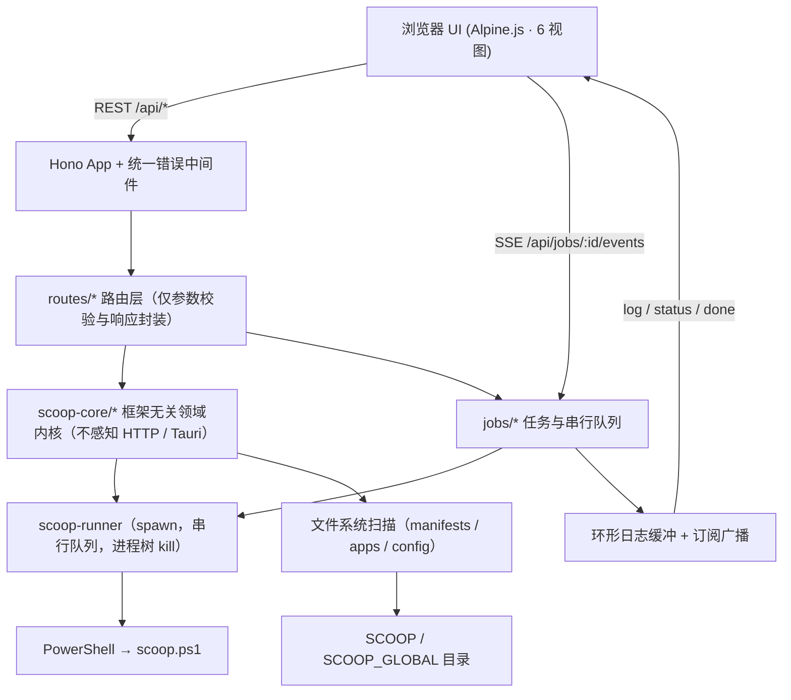

# 架构说明

本文说明 Scoop Manager 的分层设计、核心机制与关键取舍，供二次开发与排障参考。

---

## 一、整体结构



分层职责：

| 层 | 职责 | 约束 |
| --- | --- | --- |
| `routes/` | 参数校验、调用内核、封装响应 | 不写业务逻辑，不直接碰进程或磁盘 |
| `scoop-core/` | 全部领域逻辑（框架无关） | **不感知 HTTP / Tauri**（不引用 Hono 的 Context，也不引用 Tauri API） |
| `jobs/` | 「长耗时 + 流式输出 + 可取消」的统一封装 | 对外只暴露 Job 契约 |
| `scoop-core/runner.ts`<br>`scoop-core/locator.ts` 等 | 与外部世界（进程 / 磁盘）交互的**唯一出口** | 便于替换与测试 |
| `server/` | Hono 组装、运行时适配、静态资源、错误模型 | — |
| `utils/` | 无状态的通用工具 | 不依赖上层 |

---

## 二、核心策略：读走文件系统，写走 CLI

Scoop **没有**通用的 `--json` 开关。`list` / `status` / `search` / `info` 输出的是给人看的文本表格，列宽、颜色、分页行为都随版本变化，解析极易失效。

因此本工具把操作拆成两类：

### 1. 状态读取 → 一律走文件系统 / JSON

| 数据 | 来源 | 成本 |
| --- | --- | --- |
| 已安装应用 | 扫描 `<SCOOP>/apps/*/current/manifest.json`（版本 / 描述 / 主页）与 `install.json`（bucket / 架构 / hold），`current` 的 mtime 作为更新时间 | 一次目录遍历，毫秒级，缓存 3 秒 |
| 应用搜索 | 扫描 `<SCOOP>/buckets/<bucket>/bucket/*.json` 建内存索引 | 首次全量 O(N)，之后按目录快照增量重建 |
| 配置 | 运行时探测 `config.json` 实际位置（各版本路径不同，**不可写死**） | 读一个 JSON |
| 环境 | 探测 `SCOOP` / `SCOOP_GLOBAL` 环境变量、`config.json`、默认目录，找 `scoop.ps1`、读 CHANGELOG 取版本、`Get-ExecutionPolicy` | 缓存 5 秒 |
| 可更新列表 | 「已安装版本」与「本地 manifest 版本」直接比对 | 纯内存 |

唯一例外是 `scoop export` —— 官方明确保证输出 JSON，因此「导出 Scoopfile」直接用它，并把它作为兜底手段。

### 2. 状态变更 → 才走 CLI

`install` / `uninstall` / `update` / `hold` / `unhold` / `cleanup` / `reset` / `bucket add|rm` / `config set|rm` / `cache rm` / `import` / `list` 全部通过 PowerShell 调用 `scoop.ps1`。
**Bucket 的同步例外**：Scoop 没有 `bucket update` 子命令，因此「更新 Bucket」与 Scoop 内部的 `Sync-Bucket` 一致——对每个 git 仓库执行 `git pull`（并把「配置与代理」里的代理透传给 git）。
**`list` 的定位**：只用于「原始清单」对照展示（输出进任务日志，不解析），界面数据仍以文件系统扫描为准。

> 调用 `scoop.ps1` 的命令末尾必须是 `... | Out-Default; exit $LASTEXITCODE`，顺序不能改：
> `-Command` 模式下 PowerShell 会把管道输出对象缓存到命令结束才渲染，而 `exit` 会立刻
> 终止运行空间、把它们整批丢掉。`scoop status` 的表格曾因此整块消失（只剩 `Write-Host`
> 直写的 WARN 行），而该表格正是「检查更新状态」唯一的解析来源 —— 后果是它永远解析出
> 0 项、界面显示"全部最新"。`Out-Default` 在管道内立即渲染，且不影响退出码与增量输出。

> **退出码不能单独作为成功判据**：Scoop 里有两个报错函数 ——
> `error()` 只 `write-host "ERROR xxx"` 就返回，`abort()` 才会 `exit <code>`。
> 也就是说 `error()` 路径的失败**退出码是 0**（例如对安装残骸执行 `scoop uninstall`，
> 只会打印 `ERROR 'xxx' isn't installed.`）。因此 `jobs/execute.ts` 的 `translateResult`
> 在退出码为 0 时还要检查 stdout 有没有行首 `ERROR ` 的 fatal 行，否则会把"什么都没做"
> 报成成功。「安装残骸」的完整背景见 [TROUBLESHOOTING 第 22 节](./TROUBLESHOOTING.md)。

### 这样做的收益与代价

**收益**

- 读取快（不受 PowerShell 冷启动影响的百毫秒级延迟）
- 不随 Scoop 的文本输出格式变化而失效
- 搜索可离线、可即时响应（输入即搜）

**代价**

- 本地 bucket 未 `git pull` 时，可更新列表会滞后 → 前端明确提示「结果基于本地 bucket 数据」，并引导用户先执行「更新 Bucket」
- 需要处理「已安装应用不在任何本地 bucket 中」的情况 → 结果标记为「未知来源」，不影响展示

---

## 三、命令执行器（安全与稳定性的关键）

实现在 `scoop-core/powershell.ts` + `scoop-core/runner.ts`。

### 定位 PowerShell

优先 `pwsh.exe`（PowerShell 7），回退 `powershell.exe`，路径全部用绝对路径探测。

### 统一调用形式

```
powershell.exe -NoProfile -NonInteractive -ExecutionPolicy Bypass -Command "<prelude>; & '<scoop.ps1>' '<arg1>' '<arg2>'"
```

`prelude` 固定设置：

```powershell
$ErrorActionPreference = 'Continue'
[Console]::OutputEncoding = [Text.Encoding]::UTF8
$OutputEncoding = [Text.Encoding]::UTF8
```

这条 prelude 专门解决 **Windows PowerShell 5.1 重定向输出按 OEM 代码页编码导致的乱码**问题。

### 安全约束

- **绝不使用 `shell: true`**，避免命令注入
- 参数以单引号包裹，并把参数内的 `'` 转义为 `''`
- 所有用户输入先经过白名单正则校验（见 [API.md 的输入校验规则](./API.md#输入校验规则)）
- 变更类操作**串行排队**（Scoop 自身并发不安全）；只读操作允许并行

### 取消

取消时用 `taskkill /pid <pid> /T /F` 杀掉整个进程树（同样不经过 shell），确保 `scoop.ps1` 派生的子进程（如 git、7z、下载器）一并终止。

### 超时

每类操作都有明确的超时上限，超时归为 `timeout` 终态：

| 操作 | 上限 |
| --- | --- |
| `scoop config` | 1 分钟 |
| `scoop uninstall` / `cleanup` | 15 分钟 |
| `scoop checkup` / `hold` | 5 分钟 |
| `git pull`（同步 Bucket） | 20 分钟 |
| `scoop install` | 30 分钟 |
| `scoop update` / `scoop import` | 60 分钟 |

---

## 四、任务与 SSE

### Job 契约

`jobs/types.ts` 是**后端、接口、前端三层唯一的共享契约**，任何字段调整都必须同步更新 `docs/API.md` 与 `public/js/sse.js`。

```ts
type JobStatus = 'queued' | 'running' | 'succeeded' | 'failed' | 'canceled' | 'timeout';

interface JobEvent {
  seq: number;                  // 单调递增，用于断线补偿
  ts: number;
  type: 'log' | 'status' | 'done' | 'hint';
  stream?: 'stdout' | 'stderr' | 'system';
  text?: string;
  status?: JobStatus;
  exitCode?: number | null;
  error?: { code: string; message: string; detail?: unknown };
  hint?: JobHint;               // type === 'hint'：新识别出的一条建议
}
```

### 任务管理器

`jobs/manager.ts`：内存 `Map` + 状态机 + **环形日志缓冲**（每任务保留最近 N 行，超出丢弃并置 `truncated`）+ 订阅广播。

- 每个事件分配单调递增的 `seq`
- `eventsSince(id, since)` 支持按序号重放
- 订阅者通过回调收到增量事件

### 串行队列

`scoop-core/queue.ts` 保证变更类任务**串行执行**：新任务入队等待，而不是并发调用 Scoop。只读操作（如 `scoop status`、`export`）标记 `serial: false`，不入队。

`runner` 与 `/api/jobs`、`/api/health` 上报的 `queued` 共用同一个 `mutationQueue` 实例，因此该指标反映的就是真实排队数（不含正在执行的那一个）。

### SSE 事件流

`GET /api/jobs/:id/events`：

1. **重放历史**：按 `?since=<seq>`（或 `Last-Event-ID`）推送缓冲中的历史事件；若缓冲已裁剪，追加一条 `notice` 事件告知前端
2. **任务已结束**：直接发 `eof` 并关闭，不保持长连接
3. **任务进行中**：订阅增量，使用 `Promise.race` 在「新事件」与「15 秒心跳」之间等待，避免连接被中间代理或浏览器回收
4. 客户端断开时通过 `stream.onAbort` 取消订阅

前端 `public/js/sse.js` 负责：记录最后收到的 `seq`，断线后带 `since` 重连，并采用**指数退避**（最长 8 秒）。因此刷新页面或短暂断网后，日志仍能完整补齐。

### 日志建议（hints）

`jobs/hints.ts` 是一张**规则表**：逐行匹配日志文本，命中就产出一条带一键操作的提示。它处理的是
「Scoop 没报失败、但日志里有需要人处理的信号」这一类情况 —— 最常见的是第三方 bucket 的清单脚本
引用了另一个 bucket 的辅助模块，于是 `Import-Module` / `Mount-ExternalRuntimeData` 一片红，
而应用其实装成功了（见 [TROUBLESHOOTING 第 22 节](./TROUBLESHOOTING.md)）。

**为什么放在后端**：日志在后端产出、任务摘要本来就要落盘。建议随摘要持久化（刷新页面、重启服务后
仍在），也避免前端为了同一条规则再扫一遍日志。

- 扫描发生在 `JobManager.log()` —— 所有输出的唯一入口。识别到就立刻发 `hint` 事件，
  **不必等任务结束**：批量更新动辄几分钟，那之后才提示就太晚了。
- 去重键是「规则 + 关键词」（如 `bucket-helper-missing:dorado`），因此两个不同的 bucket 各报一条，
  同一个问题只报一次。恢复任务时把已有建议传回扫描器，所以重启后不会重复产出。
- 单任务封顶 `MAX_HINTS_PER_JOB` 条，避免异常输出把任务摘要撑大。
- 建议里只带**动作描述**（打开表单 / 切视图），真正的写操作仍由用户在界面上确认 ——
  不让日志内容直接驱动变更。
- 规则**宁可漏报，不可误报**：误报会给出错误的操作按钮，比漏报更糟。因此每条规则都要求足够的
  上下文（例如必须同时看到「模块加载失败」与 `buckets\<name>\scripts\` 路径），并由
  `scripts/hints-selftest.ts` 用真实报错文本回归、用正常输出做误报护栏。

### 历史持久化

任务历史落盘到 `%USERPROFILE%\.scoop-manager\jobs.json`。

> 刻意**不写在 exe 同级目录**：用户很可能把 exe 放进 Program Files 或只读目录，那里没有写权限。数据目录可用环境变量 `SCOOP_MANAGER_HOME` 覆盖。

---

## 五、静态资源与打包

同一套代码要覆盖三种运行形态：

1. **开发态**：`public/` 在源码树中，直接读磁盘
2. **Node 构建态**：`dist/server/static.js` 向上两级仍是项目根，读磁盘
3. **Bun 单文件 exe**：`public/` 通过 `compile.assets` 内嵌，Bun 映射到 `$bunfs`，对 `node:fs` 依然可见

因为无法在编译期确定内嵌资源的挂载点，`server/static.ts` 采用**「候选路径 + 内嵌兜底」**两段式解析：

```
join(moduleDir, '../../public')  →  join(moduleDir, '../public')  →  join(moduleDir,'public')
→  join(cwd, 'public')  →  join(cwd, 'dist/public')
→  /$bunfs/root/public  →  /$bunfs/root/src/public  →  /$bunfs/root/dist/public
→  Bun.embeddedFiles 按文件名索引查找
```

内嵌索引会把 Bun 默认附加的 8 位内容哈希（如 `style-a1b2c3d4.css`）规范化回原名；打包脚本同时设置 `naming.asset = '[name].[ext]'` 从根本上避免哈希，让开发态与编译态路径完全一致。

解析结果会在启动横幅与 `GET /api/health` 的 `static` 字段中暴露，出问题时不必翻日志。

### 打包命令

`scripts/build-exe.ts`：

```ts
await Bun.build({
  entrypoints: ['src/index.ts'],
  minify: true,
  bytecode: true,                       // 顶层选项，提升启动速度
  naming: { asset: '[name].[ext]' },
  compile: {
    target: 'bun-windows-x64',
    outfile: 'dist/scoop-manager.exe',
    assets: ['public'],                 // 整棵目录树内嵌
    autoloadDotenv: false,
    autoloadBunfig: false,
    windows: { title, publisher, version, description, copyright, icon },
  },
});
```

> Windows 元数据依赖 Windows API，**只能在本机为 Windows 目标编译时写入**；跨平台交叉编译时脚本会自动跳过并给出提示。

### 类型策略

`tsconfig.json` 只引入 `node` 类型（`"types": ["node"]`），Bun 的全局对象通过 `src/types/globals.d.ts` 局部 `declare`，避免 node 与 bun 类型定义冲突。`scripts/` 被排除在 `tsc` 之外（由 Bun 直接执行）。

---

### 子路径与反向代理

部署在 `/scoop/` 这类子路径下时，需要解决「前端如何知道自己的对外前缀」。方案对比：

| 方案 | 问题 |
| --- | --- |
| 构建期写死前缀 | 换前缀要重新打包，与「单文件 exe 可直接分发」冲突 |
| `<base href="/scoop/">` | 会改变文档内**所有**相对 URL 的基准，包括 SVG 精灵里上百个 `href="#i-xxx"` 片段引用，容易整体掉图标 |
| 内联 `<script>window.__BASE__=…</script>` | 服务端下发的 CSP 不含 `'unsafe-inline'`，会被浏览器拦截 |
| **`<body data-base="…">` + 相对路径资源** | 采用此方案：数据放在属性里，不涉及脚本与 URL 基准 |

具体做法：

1. `index.html` 里的静态资源全部写成**相对路径**（`css/style.css`、`js/main.js`），
   在 `/scoop/` 下自然解析为 `/scoop/css/style.css`。
2. `<body>` 上留一个 `__BASE_PATH__` 占位符，`server/app.ts` 在每次响应 index.html 时替换为实际前缀
   （index.html 本身是 `no-cache`，所以换前缀刷新即生效）。
3. `public/js/base.js` 读取该属性并导出 `appUrl()`，`api.js` 与 `sse.js` 用它拼接口地址。
4. 前缀来源：`--base-path` 配置优先，其次是 `X-Forwarded-Prefix` 请求头。

服务端则在入口对请求做一次**路径归一化**（`createFetchHandler`），从而同时支持两种代理写法：
透传前缀（后端收到 `/scoop/api/...`，去掉前缀后交给 Hono）与剥离前缀（后端本来就没前缀，天然可用）。
当请求恰好等于前缀无尾斜杠时，返回 308 跳到带斜杠的地址，保证相对路径资源能解析到正确目录
（这里刻意使用**相对** Location，避免把内部监听地址泄露给客户端）。

---

## 六、性能与可靠性

| 关注点 | 措施 |
| --- | --- |
| Bucket 索引 | 首次全量扫描 O(N)（通常数千个 JSON，百毫秒级）；之后按目录 mtime 快照增量重建；索引常驻内存，重复搜索为 O(result) |
| 已安装应用扫描 | 单次目录遍历 O(apps)，结果缓存 3 秒；变更类任务结束后主动失效 |
| 前端日志渲染 | 只渲染末尾 600 行（缓冲上限 4000 行），避免上万行 DOM 导致卡死；完整内容用「复制 / 下载」 |
| SSE 保活 | 15 秒心跳；`?since=` 断线补偿；指数退避重连 |
| 端口占用 | `EADDRINUSE` 时自动递增寻找可用端口，并明确告知用户实际端口 |
| 平台守卫 | 非 Windows 时服务仍启动，所有 scoop 相关接口返回结构化错误，前端展示阻断式提示而非崩溃 |
| 退出 | 收到 `SIGINT` / `SIGTERM` / `SIGHUP` 时把任务历史落盘并优雅关闭 |

---

## 七、关键取舍记录

| 决策 | 备选方案 | 选择理由 |
| --- | --- | --- |
| 读取走文件系统，不走 `scoop list/search` | 解析 CLI 文本输出 | 文本格式不稳定，解析随版本失效；文件系统读取快且结构化。**例外**：已安装页提供「原始清单」入口执行 `scoop list` 并把输出原样打进任务日志（只展示、不解析），供两者对不上时对照上游 |
| 前端 Alpine.js 本地内置，零构建 | Vue/React + 打包器 | 无构建步骤 = 改完刷新即生效；单文件 exe 体积可控；离线可用 |
| 自研任务队列与日志缓冲 | 引入现有日志/队列库 | 需求简单（约 200 行），避免重依赖与类型冲突 |
| 参数转义 + 白名单正则，绝不 `shell: true` | 拼接命令字符串 | 从根上消除命令注入风险 |
| 单文件 exe 内嵌 `public/` | 分发时附带资源目录 | 真正「单文件」，可拷贝到任意机器运行 |
| 数据目录放在 `~/.scoop-manager` | 放在 exe 同级 | exe 可能位于无写权限的目录 |
| Hono | Express | 轻量、跨运行时（Node/Bun 同一套 handler）、原生 `streamSSE` |
| 不做鉴权 | 内置登录 / Token | 明确由用户的反向代理层负责访问控制；本地工具保持零配置 |
| 子路径前缀运行时注入 | 构建期写死 / 使用 `<base href>` | 一份产物可部署在任意前缀；`<base>` 会破坏 SVG 片段引用 |
| 同时兼容剥离与透传前缀 | 只支持一种 | 现实中的 nginx 配置两种写法都很常见，兼容成本很低 |

---

## 八、扩展点

| 想做的事 | 改动位置 |
| --- | --- |
| 新增一个 scoop 操作 | `routes/*` 加路由 → `scoop-core/*` 调用 → `startJob(...)` 创建任务；前端在对应 view 里调用 |
| 新增任务类型文案 / 颜色 | `jobs/types.ts` 的 `JobKind` + `public/js/format.js` 的 `JOB_KIND_LABEL` |
| 新增前端页面 | `public/index.html` 加 `<section class="view">` + `public/js/views/*.js` + `public/js/main.js` 的 `NAV_ITEMS` 与 `loadView` |
| 调整主题 | `public/css/style.css` 顶部的 `:root` 设计令牌 |
| 调整超时 / 并发策略 | `scoop-core/runner.ts` 的 `RunOptions` 与各路由传入的 `timeoutMs` |
| 调整日志缓冲上限 | `jobs/manager.ts` 的缓冲容量常量 |
| 新增桌面端托盘项 | `desktop/src/tray.rs` 的菜单构建与事件匹配 |

---

## 九、两种运行模式（服务模式 / 应用模式）

同一份业务内核，两种**完全隔离**的传输形态。

### 为什么需要隔离

服务模式下 API 走 HTTP + TCP 端口，便于浏览器访问、反向代理与 pm2 托管；但桌面应用不该占用端口 —— 一个桌面程序在后台长期监听 `127.0.0.1:xxxx`，既不必要（页面与后端在同一台机器、同一个窗口里），也扩大了本机攻击面（任何本机进程或网页都能调用无鉴权的本地 API）。

因此桌面端改用 **stdin/stdout 二进制分帧**，物理上不存在可被外部访问的入口。

### 隔离矩阵

| 维度 | 服务模式（`--rpc` 缺省） | 应用模式（`--rpc stdio`） |
| --- | --- | --- |
| 传输 | HTTP over TCP | stdin/stdout 分帧 |
| 端口 | 监听并可自动后移 | **完全不监听** |
| 入口 | `src/modes/service.ts` | `src/modes/desktop.ts` |
| 适配器 | `server/adapter.bun.ts` / `adapter.node.ts` | `server/adapter.ipc.ts` |
| 静态资源 | Hono 提供（内嵌 `$bunfs` 或磁盘） | Tauri 从 `desktop/ui/` 提供 |
| 数据目录 | `%USERPROFILE%\.scoop-manager` | `%USERPROFILE%\.scoop-manager-desktop` |
| 浏览器访问 | 支持 | 不适用 |
| 生命周期 | 自主进程 / pm2 | 随外壳，由托盘控制 |

### 分层约束

传输差异**只允许出现在两层**：`src/modes/` 与 `src/server/adapter.*.ts`。`routes/`、`scoop-core/`、`jobs/`、`server/app.ts` 对传输方式零感知 —— 机械判据是：全仓库搜索 `rpc` 只应命中 `index.ts`、`modes/desktop.ts`、`server/adapter.ipc.ts`、`config.ts`、`runtime.ts`、`utils/logger.ts` 六个文件。

### IPC 帧格式

两个方向一致：

```text
u32 BE headerLength | JSON header (UTF-8) | body (bodyLength 字节)
```

设计要点：

- **长度前缀而不是 NDJSON**。NDJSON 要求 body 是合法 JSON 字符串，会带来一次 JSON 转义；Tauri 的 `invoke` 信封还会再转义一次。长度前缀让 body 以原始字节直传。
- **普通响应只有 `response` 一帧**（body 挂在尾部），只有 SSE 才会出现 `chunk` / `end`，省掉一次往返。
- **`stream: true` 显式标志**而不是嗅探 content-type，外壳无需理解 HTTP 语义。
- 控制帧 `{"type":"shutdown"}` 用于请求优雅退出。

### 零转义的三层保证

| 环节 | 做法 |
| --- | --- |
| sidecar → Rust | 长度前缀分帧，body 走原始字节 |
| Rust → WebView | `tauri::ipc::Response` + `InvokeResponseBody::Raw`，绕过 JSON 信封 |
| WebView 解码 | 垫片按同一布局切出 body，直接 `new Response(body, …)` |

### 生命周期：三重退出保障

| 触发方式 | 机制 |
| --- | --- |
| 用户点托盘「退出」 | Rust 先发 `shutdown` 控制帧 → sidecar `jobManager.flush()` → 等 2 秒 → `kill()` 兜底 |
| 外壳被任务管理器强杀 | OS 关闭管道 → sidecar 的 stdin `close` 事件 → 同样走优雅退出 |
| 外壳崩溃 / 异常消失 | sidecar 的 `--parent-pid` 守护每 2 秒探测一次，父进程消失即自行退出 |

三者叠加，`jobs.json` 的最后一次落盘不会丢，也不会留下孤儿进程。

### 静态资源为什么复制一份

`public/index.html` 里的资源地址带 `__BASE_PATH__` 占位符，服务模式下由 Hono 在响应时按部署前缀替换。Tauri 直接读磁盘文件没有这一层，占位符会原样保留导致资源 404。因此 `scripts/build-ui.ts` 把 `public/` 复制为 `desktop/ui/` 并把占位符替换为空串（桌面端固定根路径部署）。

### 垫片的注入方式

`desktop/shim/ipc-shim.js` 通过 `WebviewWindowBuilder::initialization_script` 注入，由 WebView 在**页面任何脚本之前**执行。这就是 `public/` 目录能够零改动的原因：`api.js` 取 `window.fetch`、`sse.js` 取 `window.EventSource` 时，拿到的已经是被替换过的实现。

垫片的拦截范围刻意收得很窄：只接管**同源的 `/api/**`** 请求与 `EventSource`，静态资源、外链一律交回原生实现；`invoke` 自身使用的 `ipc.localhost` / `ipc://` 地址天然不匹配，不会产生递归。

### 两个踩过的坑

| 坑 | 现象 | 结论 |
| --- | --- | --- |
| `bytecode: true`（Bun 打包） | exe 一启动就抛 `SyntaxError: import.meta is only valid inside modules` | 字节码预编译把顶层 `import.meta` 视为"非模块上下文"，而 `server/static.ts` 需要它定位内嵌资源。已在 `build-exe.ts` 关闭，体积反而更小 |
| `tauri-plugin-shell` | 它按**行**读取子进程 stdout，而我们的协议是二进制分帧，body 里含换行会被切断 | 改为直接用 `std::process::Command` 自己读取字节流，顺带完全控制 `CREATE_NO_WINDOW` |

